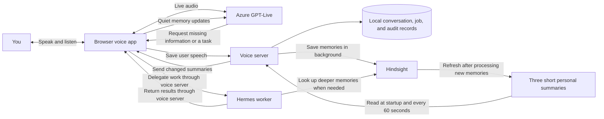

# Jarvis live voice

Jarvis is a browser voice assistant that uses Azure GPT-Live for conversation, Hindsight for personal memory, and a separate Hermes worker for deeper lookups and background tasks. Familiar facts are available before you ask, so answering them does not require a memory search or a waiting announcement. Conversation stays available while Hermes works.

## Current status

The prepared-memory update and local connection/audio diagnostics are deployed. The memory checks and 37 regression tests passed. The existing 500 ms interruption timing check remains failed; the update does not establish that interruption speed was preserved. See the [test results and limitations](docs/VOICE-MEMORY-VERIFICATION.md) and [original voice qualification record](docs/JARVIS-LIVE.md).

## How it works

Audio runs directly between the browser and Azure. Memory processing and background work run separately, so loaded personal facts add no lookup to a spoken reply.

## Which memories are ready

Hindsight maintains three focused summaries using fixed selection rules:

| Summary | What it keeps ready |
| --- | --- |
| Personal profile | Name, important people, relationships, work, and lasting interests |
| Preferences | Likes, habits, and communication preferences |
| Current priorities | Up to five active commitments, priorities, or recent decisions, favoring newer evidence |

The facts change automatically as new information is saved. Explicit corrections take precedence over older facts. Questions and assistant guesses are not treated as personal facts. These rules select a small briefing; other memories still need a lookup.

After Hindsight processes new memories, it refreshes the summaries in the background, with at least 300 seconds between refreshes. The app checks for finished updates every 60 seconds and supplies changed sections to an ongoing voice conversation without announcing them. This is not a promise that every new fact appears within six minutes: processing time can add delay. Corrections spoken in the current conversation are already available there while durable memory updates finish.

If a summary cannot be refreshed, the app keeps its last usable version and reports a health warning. See the [memory design and update rules](docs/VOICE-MEMORY.md) and [testable goal](docs/VOICE-MEMORY-GOAL.md).

## Supporting documentation

- [Hindsight: focused mental models and automatic refresh](https://hindsight.vectorize.io/best-practices#mental-models) supports preparing short summaries for common personal questions.
- [Hermes: persistent personal memory](https://hermes-agent.nousresearch.com/docs/user-guide/features/memory) describes loading a compact user profile and useful facts at session start. The voice app gets its prepared summaries from Hindsight.
- [Microsoft: add context during a live conversation](https://learn.microsoft.com/azure/foundry/openai/how-to/gpt-live#add-context-during-the-conversation) documents `session.thinking.append`, used here for quiet memory updates. This guidance was verified through Microsoft Learn MCP.
- [Microsoft: delegate work in GPT-Live](https://learn.microsoft.com/azure/foundry/openai/how-to/gpt-live-delegation) documents handing work to an application while conversation continues.

The three summary categories and refresh timing are application choices built on these documented features. The integration uses existing APIs; it does not require Hermes or Hindsight source changes.

## Live browser clock

The browser supplies its current local date, time, and time zone throughout a call. A quiet update is sent when the call connects, when the minute or zone changes, and after returning to the tab if the clock changed. Jarvis answers ordinary date/time questions directly from the latest update, without a Hermes lookup or a waiting phrase. The clock has minute precision and uses natural spoken zone names.

Startup instructions tell the voice to use these updates. The updates themselves use Microsoft's documented [`session.thinking.append`](https://learn.microsoft.com/azure/foundry/openai/how-to/gpt-live#add-context-during-the-conversation) mechanism, so they do not trigger speech. They reuse the existing acknowledgment handling and stop when the call ends. No per-question model or memory request is added.

## Run and maintain

- Repository: [realtime-ai-voice-07-2026](https://github.com/vyente-ruffin/realtime-ai-voice-07-2026)
- Entry point: `src/live/server.js`; browser: `web/live.js`
- Persistent state: the private SQLite file selected by `VOICE_STATE_PATH`
- Runtime: `voice-frontend.service`; [deployment and rollback](deploy/live-production/README.md)

Use Node 26+, installed npm dependencies, a signed-in Azure CLI identity for the configured subscription, and the existing worker/memory configuration in the [app guide](docs/JARVIS-LIVE.md) and [environment example](.env.live.example). Keep credentials, personal memories, recordings, and detailed deployment records out of Git.

- Start an appropriately configured instance: `npm run start:live`
- Run isolated regression tests: `npm run test:live`
- Browser checks also require the existing Playwright Chromium installation.
- Wait until no conversation or background job is active before restarting the voice service. Reload the browser afterward to load updated scripts.

Diagnostics write to the existing local audit table and service log. They do not add an in-app dashboard; Graylog delivery remains unverified.

[Configuration, decisions, failures, and verification history](ledger.md)
