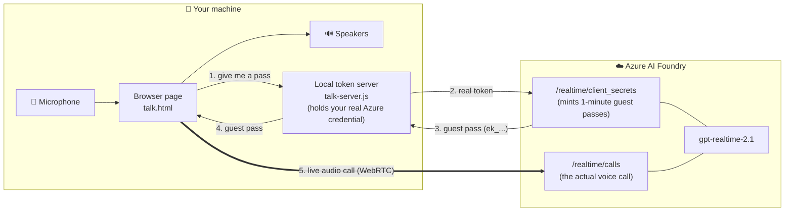
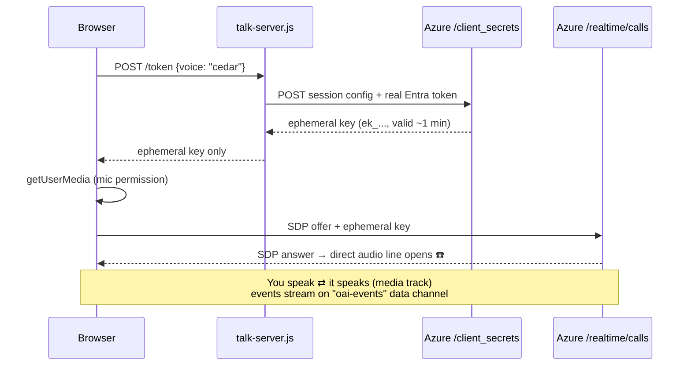
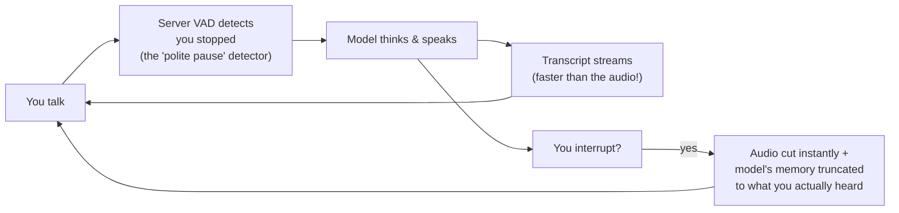

# Realtime AI Voice — detailed ledger

[Current overview](README.md)

## Historical README snapshot — captured 2026-09-22

The following complete pre-split README is historical, not a claim about current deployment. `cmp README.md ledger.md` verified identical bytes before this wrapper was added; both SHA-256 values were `350d31428fed7d7846289b13442fcb29ab3aafe06ac9dcbb9af2dedaf855ca6f`. Relative links remain rooted here.

# 🎙️ Realtime AI Voice — Talk to GPT Realtime on Azure AI Foundry

The September 2026 Jarvis candidate keeps this web app and adds direct GPT-Live conversation, prepared Hindsight memories, and separately tracked Hermes work. It is under qualification; production remains on the original entry point. See [the candidate and its validation limits](docs/JARVIS-LIVE.md) and [current progress](docs/JARVIS-LIVE-PROGRESS.md). The tutorial and earlier gate history below describe the original Realtime implementation.

Build a browser page where you **talk to an AI with your voice and it talks back** — with real interruption ("barge-in"), selectable voices, and no API keys ever touching the browser. Built July 2026 against `gpt-realtime-2.1` (model version `2026-07-07`, `GlobalStandard`, East US 2), tested end-to-end, including every mistake we hit along the way (documented in [Appendix A](#appendix-a--the-mistakes-we-actually-hit)).

> ### 🧠 This repo grew a brain
>
> The tutorial below builds the **voice harness** — the mouth and ears. On top of it,
> this repo now also contains the **Hermes Voice Platform**: the same realtime model
> demoted to *pure speech I/O*, with every spoken word originating from a local
> [Hermes agent](https://github.com/NousResearch/hermes-agent) — its memory, its
> Honcho user model, its skills and tools. Voice becomes another front-end alongside
> Telegram and the CLI, and the existing hermes install is provably untouched
> (checksum-gated on every test run).
>
> **What it does:** you talk, hermes answers in its own voice; ask it to start a long
> job and it acknowledges immediately, keeps chatting, then announces completion
> without ever talking over you; interrupt it and it cancels the work in flight;
> hang up and pending results arrive on Telegram.
>
> - 📋 **[The build plan](docs/VOICE-PLATFORM-PLAN.md)** — north star, 6 milestones,
>   63 binary gates, and a citation index where every API claim is traceable to
>   Microsoft Learn or the OpenAI/ACP/hermes docs.
> - 🏗 **Status:** M0–M4 built and gated (63/63, tags `v0.0.1`–`v0.4.0`). M5 (making
>   voice a first-class `hermes gateway` platform) awaits the owner's approval.
> - 🧾 **[ADR-001](docs/ADR-001-observer.md)** — why `webrtcfilter=on` was rejected
>   despite two of its own tests passing.
> - 🤖 **[CLAUDE.md](CLAUDE.md)** — machine handoff: state, gotchas, how to re-certify.
>
> **Run it:** `node talk-server.js` with the env below, wait for `"Brain warm"` in the
> log (~30s — hermes loads 175 MCP tools), then open http://localhost:8787.

---

## Change log

Append-only, newest at the bottom. Format: date — what changed — why.
Every behaviour-changing commit adds an entry here (CODER SOUL.md, RULE ZERO-D).

- 2026-09-04 — Change log started. Why: V's standing rule that every artifact
  carries a What/Why/How/When README whose changes are appended, so the history
  of a decision is readable without digging through git.
- 2026-09-04 — `talk-server.js`: an ACP reply beginning `Error: ` is now treated
  as a transport failure instead of speech — the turn fails with RFC 9457, the
  ACP child is destroyed, and a second consecutive failure exits the process for
  systemd to rebuild. Why: the ACP adapter returns an unhandled agent exception
  as a NORMAL turn whose text is `Error: <python message>`
  (`acp_adapter/server.py`), which is indistinguishable from a real answer at the
  JSON-RPC layer. A crashed brain therefore read
  `'TurnLivenessWatchdog' object has no attribute 'make_thread'` aloud to V on
  every turn from 2026-09-01 to 2026-09-04 while every process-level check said
  the service was healthy. Commit 3609f0b.
- 2026-09-04 — Added unauthenticated `GET /healthz` plus the systemd units
  `voice-frontend-health.service` / `.timer` (probe every 2 min, restart
  `voice-frontend.service` on failure). Why: the in-process detector above only
  fires when a turn COMPLETES; a wedged process completes nothing, so an external
  prober is the necessary second half of the liveness contract. The endpoint is
  deliberately unauthenticated because the auth token is minted per-process and a
  supervisor cannot hold it. Verified by SIGSTOPing the server: the probe failed
  and the service was restarted automatically.

- 2026-09-21 — Added an isolated GPT-Live entry point in the existing web app, prepared memories, persistent jobs and results, asynchronous memory saving, permissions, reconnect handling, and real received-audio qualification. Why: conversation must stay fast while Hermes works. Source/version integrity, phone acceptance, and the full scorecard remain deployment gates. See `docs/JARVIS-LIVE.md`.

---

## WHAT you're building

Two test paths, smallest first:

| # | Path | What it proves | Files |
|---|------|----------------|-------|
| 1 | **Smoke test** — send text, get spoken audio back as a `.wav` file | Your deployment works at all | `voice-test.js` |
| 2 | **Live conversation** — talk into your mic, AI answers out loud, interrupt it mid-sentence | The real voice experience | `talk-server.js` + `talk.html` |



## WHY it's built this way — first principles

**Why a "realtime" model at all?** The classic way to voice-enable an AI is a relay race: record your voice → transcribe to text (STT) → LLM thinks in text → convert reply to speech (TTS). Every baton pass adds delay and loses information (tone, hesitation, emotion). A realtime model is **one model that hears audio and speaks audio directly** — like a phone call instead of mailing letters back and forth. That's what makes sub-second, interruptible conversation possible.

**Why WebRTC for the browser (and not WebSocket)?** ELI5: a WebSocket is a walkie-talkie — you push chunks of data and hope the timing works out; *you* are responsible for capturing mic audio, encoding it, buffering playback. WebRTC is a phone line — the browser natively handles the microphone, echo cancellation, network jitter, and speaker playback. Microsoft's guidance: WebRTC for anything client-side (~50–100ms latency), WebSocket for server-to-server (~100–300ms). We use both: WebSocket for the scripted smoke test, WebRTC for the live page.

**Why a local token server?** Your Azure credential can do *anything* your account can do. You must never ship it to a browser. So a tiny local server trades your real credential for an **ephemeral key** — ELI5: a *1-minute guest pass*. The browser gets only the guest pass; even the session rules (which model, which voice, the system prompt) are baked in server-side when the pass is minted, so the browser can't tamper with them. This is the pattern Microsoft documents for production.

**Why keyless (Entra ID) instead of API keys?** No key to leak, rotate, or commit by accident. Your `az login` identity + an RBAC role is the whole story. (Standard: OAuth 2.0 / OIDC everywhere.)

## HOW — step by step from zero

### Step 0 — Prerequisites

- An Azure subscription
- [Azure CLI](https://learn.microsoft.com/cli/azure/install-azure-cli) installed and `az login` done
- [Node.js](https://nodejs.org) 22+ (`node -v`)
- A machine with a **microphone** for Part 2 (sounds obvious — cost us an hour; a Mac mini has none)

### Step 1 — Create the Foundry resource and deploy the model

Follow: [Create a Microsoft Foundry resource](https://learn.microsoft.com/azure/ai-services/multi-service-resource?pivots=azportal) → then [deploy the realtime model](https://learn.microsoft.com/azure/foundry/openai/how-to/realtime-audio-websockets#deploy-a-model-for-real-time-audio):

1. Go to the [Foundry portal](https://ai.azure.com), create/select a project
2. **Models + endpoints** → **+ Deploy model** → **Deploy base model**
3. Search `gpt-realtime` (or `gpt-realtime-mini` for cheaper testing) → **Deploy**
4. ⚠️ Region matters for WebRTC: use **East US 2** or **Sweden Central**

Verify from the CLI:

```bash
az cognitiveservices account deployment list \
  -g <your-resource-group> -n <your-resource-name> \
  --query "[].{deployment:name, model:properties.model.name, state:properties.provisioningState}" -o table
```

### Step 2 — Give yourself data-plane access (RBAC)

Portal → your resource → **Access control (IAM)** → **Add role assignment** → **Cognitive Services OpenAI User** → your account. ([Troubleshooting reference](https://learn.microsoft.com/azure/foundry/openai/how-to/realtime-audio-webrtc#troubleshooting) — a 401 here usually means this role is missing.)

### Step 3 — Get the code

```bash
git clone https://github.com/<you>/realtime-ai-voice-07-2026.git
cd realtime-ai-voice-07-2026
npm install        # installs: openai, ws, @azure/identity
```

What each file is and why it exists:

| File | What | Why |
|---|---|---|
| `voice-test.js` | Text in → spoken `.wav` out over WebSocket | Prove the deployment works before adding browser complexity |
| `talk-server.js` | Serves the page + mints ephemeral keys | Keeps your real credential out of the browser (see WHY above) |
| `talk.html` | The voice UI: mic capture, WebRTC call, live transcript, voice picker | The actual "talk to it" experience |
| `index.js` | Microsoft's original [WebSocket quickstart](https://learn.microsoft.com/azure/foundry/openai/how-to/realtime-audio-websockets#voice-agent-quickstart) sample | Untouched reference |
| `src/core/logger.js` | One structured logger every script imports | Standard: console locally, flips to Azure Monitor via one env var |

### Step 4 — Smoke test (hear it speak)

```bash
AZURE_TOKEN=$(az account get-access-token --resource https://ai.azure.com --query accessToken -o tsv) \
AZURE_OPENAI_ENDPOINT=https://<your-resource-name>.services.ai.azure.com \
AZURE_OPENAI_DEPLOYMENT_NAME=<your-deployment-name> \
node voice-test.js
```

> 💡 If your resource is in a **different subscription/tenant** than your az default, add `--subscription <sub-id>` to the token command. This exact issue cost us the most debugging time — see [Appendix A](#appendix-a--the-mistakes-we-actually-hit).

Success looks like: a JSON log line with the transcript, and `output.wav` you can play (`afplay output.wav` on macOS). Under the hood this connects to `wss://<resource>/openai/v1/realtime?model=<deployment>` — the **GA** endpoint style: everything lives under `/openai/v1/`, **no `api-version` parameter** ([migration guide](https://learn.microsoft.com/azure/foundry/openai/how-to/realtime-audio-preview-api-migration-guide)).

### Step 5 — Live conversation

```bash
AZURE_TOKEN=$(az account get-access-token --resource https://ai.azure.com --query accessToken -o tsv) \
AZURE_OPENAI_ENDPOINT=https://<your-resource-name>.openai.azure.com \
AZURE_OPENAI_DEPLOYMENT_NAME=<your-deployment-name> \
node talk-server.js
```

Open **http://localhost:8787** → pick a voice → **Start** → allow the mic → talk.

What happens when you click Start (from the [WebRTC how-to](https://learn.microsoft.com/azure/foundry/openai/how-to/realtime-audio-webrtc)):



And during conversation, each turn works like this:



### Step 6 — Tune it

The page has a **Session settings** panel — persona presets (assistant, interviewer, Spanish tutor, storyteller) with an editable system prompt, voice, speed, patience, and noise reduction — plus a mute button and a live **orb visualization**: a green core that swells when the model speaks, a blue ring that expands when it hears you, breathing when idle, gray when muted. The browser only *requests* these settings; `talk-server.js` validates and clamps every value before baking them into the ephemeral session ([events reference](https://learn.microsoft.com/azure/foundry/openai/realtime-audio-reference)):

| Knob | Values | What it does |
|---|---|---|
| `voice` | `marin`, `cedar` (newest/most natural), `alloy`, `ash`, `ballad`, `coral`, `echo`, `sage`, `shimmer`, `verse` | The voice. **Locks after the first spoken word** of a session — that's why the page's dropdown disables while live |
| `interrupt_response` | `true` / `false` | `true` = your speech cuts it off (ChatGPT-style). `false` = it always finishes its sentence |
| `turn_detection.type` | `server_vad` (**what this repo sends**) / `semantic_vad` | `server_vad` ends your turn after a fixed silence. `semantic_vad` uses a classifier to decide whether the sentence actually sounded finished, and sets the timeout dynamically — so "and, uhh..." doesn't cut you off. Supported on `gpt-realtime` / `gpt-realtime-mini` family, which includes `gpt-realtime-2.1`; verified accepted by this deployment |
| `eagerness` | `low` / `medium` / `high` / `auto` (default `auto`) | `semantic_vad` only. `high` commits to your turn sooner (lower latency, more risk of cutting you off); `low` waits longer |
| `silence_duration_ms` | e.g. `500` | `server_vad` only. How long a pause means "your turn is over". This repo sends `500`, so every turn pays a fixed half-second before the brain is even called |
| `speed` | `0.25`–`1.5` | Talking speed |
| `instructions` | text | The system prompt |
| `noise_reduction` | `near_field` / `far_field` | Match your mic: headset vs room/laptop mic |
| `transcription` | `{ model: "whisper-1" }` | Enables "You:" lines — without it, your side of the conversation is never transcribed |

### Step 7 — Reach it from your phone (or any other machine)

`getUserMedia` refuses to hand over a microphone unless the page is a **secure context** — `https://` or `localhost`. That single rule is why the app works on the host machine and appears "broken" everywhere else. Two ways around it:

**A. Another computer — SSH tunnel.** The page arrives as `localhost`, which counts as secure:

```bash
ssh -L 8787:localhost:8787 <user>@<host>     # leave running
# then open http://localhost:8787 on your laptop
```

**B. A phone — [Tailscale](https://tailscale.com) with real HTTPS.** A tunnel isn't an option on iOS, and a self-signed cert still blocks the mic. Tailscale issues a genuine Let's Encrypt certificate for your machine's private `.ts.net` name, so the browser grants mic access:

```bash
tailscale serve --bg 8787       # proxies https://<machine>.<tailnet>.ts.net -> localhost:8787
tailscale serve status          # confirm
```

Install Tailscale on the phone, sign in with the same account, then open `https://<machine>.<tailnet>.ts.net`. Nothing is exposed to the public internet — only your own devices can reach it.

Two things that will bite you:

- **The server's CORS allowlist must include the tailnet origin.** A phone's `Origin` is the `.ts.net` hostname, not `localhost`; without it every `/token` call returns `403` while the page itself loads fine. `talk-server.js` accepts `https://*.ts.net` for this reason.
- **On wifi the hostname may not resolve.** `.ts.net` names are answered only by Tailscale's resolver (`100.100.100.100`). If a phone prefers the local router's DNS it will fail on wifi and work on cellular — a confusing split. Fix: enable **"Use Tailscale DNS"** in the phone's Tailscale app, or **"Override local DNS"** in the [tailnet DNS admin page](https://login.tailscale.com/admin/dns).

### Step 8 — Keep it running

Started by hand, the server dies with its terminal and nothing survives a reboot. `watchdog.sh` plus a launchd agent fixes that. Every 30 seconds it verifies the listener, the real local application page, the exact Tailscale Serve proxy, the certificate-backed remote page, and the `hermes -p voice acp` child. Every five minutes it also mints (but never prints) a real Azure Realtime ephemeral key. A failed check converges Tailscale/Serve and restarts the voice stack, then verifies recovery.

```bash
cp watchdog.sh <somewhere-stable>            # it references absolute paths; edit REPO/PORT at the top
launchctl load ~/Library/LaunchAgents/com.405network.talkserver.plist
bash tests/watchdog-healthcheck.sh            # healthy + three fail-closed scenarios
tail -f ~/.405network/logs/talkserver-watchdog.log
```

The launchd agent must set `PATH` explicitly — launchd does **not** inherit your shell's, so `~/.local/bin` is missing and the server dies at startup with `spawn hermes ENOENT`.

Chosen over installing `tailscaled` as a root system daemon: identical recovery from reboots and crashes, one moving part instead of two, no `sudo`. The tradeoff is that it runs in the login session, so a full logout stops it — irrelevant on an always-logged-in machine, wrong for a headless server.

### Where the conversation is recorded

`logs/` holds several files that look interchangeable but are not:

| File | Contents |
|---|---|
| **`voice-audit.log`** | **The real transcript** — `question`, `hermesSaid` (what the brain wrote), `mouthSpoke` (what was actually said), plus a `jaccard` score flagging when the voice improvised instead of reading the brain's words |
| `turns-routed.log` | Latency only — your words in full, but the reply as `chars: 187`. **Not** a transcript |
| `turns.log` | Raw user speech as it arrived |
| `fillers.log` / `cancel.log` / `announcements.log` | Stalls, barge-ins, out-of-turn task completions |

Read the conversation:

```bash
grep '"kind":"reply"' logs/voice-audit.log | tail -5 | \
  python3 -c 'import sys,json
for l in sys.stdin:
    d=json.loads(l); print("YOU:",d["question"][:120]); print("AI :",d["mouthSpoke"][:200],"\n")'
```

---

## Troubleshooting (every one of these actually happened)

| Symptom | Real cause | Fix |
|---|---|---|
| WebSocket fails with opaque `400` | Token minted for the **wrong tenant** (multi-tenant account) | `az account get-access-token --subscription <sub-that-owns-the-resource> ...` |
| `AADSTS700016` when setting `AZURE_TENant_ID` | Your default az login doesn't exist in that tenant | Same fix — select by `--subscription`, not `--tenant` |
| curl test of the WS endpoint returns `404` | curl used HTTP/2, which silently drops the `Upgrade` | Add `--http1.1` |
| `NotFoundError: The object can not be found here` | **The machine has no microphone** | Plug in AirPods/headset; it's hardware, not code |
| Page works locally, mic dead from another computer | `getUserMedia` needs a secure context (`https://` or `localhost`) | SSH tunnel: `ssh -L 8787:localhost:8787 user@host`, then open `localhost:8787` there |
| It stops talking but text keeps printing | By design — text streams faster than speech; on interrupt the *audio* is cut and the model's memory truncated to what you heard | Cosmetic: freeze the transcript on `output_audio_buffer.cleared` (this repo does) |
| Your "You:" line appears *after* the model's reply to it | Input transcription (whisper) is a slower parallel job — the model answers your raw audio before your words are transcribed | Reserve the line on `input_audio_buffer.committed`, fill it by `item_id` when transcription completes (this repo does) |
| `/token` starts failing after ~1 hour | Entra token expired | No longer applies — `talk-server.js` re-mints via `az` before expiry. If it still fails, your `az` session itself has lapsed: `az login` |
| `401` on `/client_secrets` | Missing RBAC role | Step 2 |
| `403` on WebRTC | Resource not in East US 2 / Sweden Central | Redeploy in a supported region |
| Page loads on the phone, but `/token` returns `403` | The CORS allowlist has only `localhost`; the phone's `Origin` is the `.ts.net` hostname | Allow `https://*.ts.net` (Step 7) |
| Works on cellular, fails on wifi | Phone is asking the local router's DNS, which knows nothing of `.ts.net` | "Use Tailscale DNS" on the phone, or "Override local DNS" tailnet-wide (Step 7) |
| Server dies at startup with `spawn hermes ENOENT` — but runs fine by hand | launchd does not inherit your shell `PATH`, so `~/.local/bin` is missing | Set `PATH` explicitly in the launchd plist (Step 8) |
| A voice question starts tools but never gives an answer or task receipt | Hermes ignored the prompt-only 15s delegation rule; the single ACP session stayed blocked until cancel/timeout | Server-enforced long-turn handoff now returns a receipt at 15s, detaches that ACP session as the background worker, and opens a fresh brain for conversation |
| `502` through the Tailscale URL | Tunnel is up, but nothing is listening on 8787 behind it | Check the server is actually running — `lsof -ti:8787` |

## Voice long-turn reliability contract

### What / when / why

As of **2026-08-07**, every real Hermes voice turn has a server-enforced response boundary. A turn that finishes before 15 seconds follows the normal answer path. A turn still active at 15 seconds returns the machine receipt `TASK-ACCEPTED <voice-handle>` (rendered as a short natural sentence by the mouth), maps that handle to the full ACP session in the audit log, keeps the original work running, and announces its final answer when that work resolves.

This repairs the production incident recorded in `~/.405network/logs/talkserver.log` at `2026-08-06T21:37:53Z`: a model-latency question triggered foreground skill/file searches, including three 20.8s failed reads and a 60.5s search. No receipt was emitted; barge-in cancelled the shared ACP session, and `/turn` eventually failed at the five-minute protocol timeout. A prompt telling the model to delegate was policy, not an enforcement mechanism.

### First principles and plan

- Spoken dead air is a user-visible failure; a filler is not a task receipt.
- The work already running is the source of truth. Do not duplicate, suppress, or fake it.
- `Promise.race` selects the foreground response boundary but does not cancel the losing work promise.
- Once a turn is backgrounded, the application issues a real `voice-<8 hex>` task handle, records its mapped ACP session, and detaches that ACP child from the foreground slot. A replacement foreground ACP child starts immediately, so new speech never queues behind or cancels the detached task.
- Desired state: quick answer inline; slow answer acknowledged by 15s; completion spoken later; unrelated turns remain available.
- Undesired state: one shared ACP child remains occupied, barge-in cancels the work, or the caller waits for the 300s `session/prompt` timeout.
- Out of scope: changing the Hermes model, hiding tool failures, weakening the 15s contract, or making process-local ACP work survive a machine restart. Durable work still belongs in Hermes cron/background-terminal facilities.

```text
voice transcript
      |
      v
Hermes ACP prompt ----- finishes <15s -----> normal spoken answer
      |
      +---- still active at 15s
                 |
                 +--> TASK-ACCEPTED <voice handle> --> natural spoken receipt
                 |
                 +--> detach busy ACP child ------> fresh foreground brain
                 |
                 +--> original work completes ----> TASK-DONE audit + announcement
```

The 15-second clock begins when `/turn` receives the transcript and includes ACP acquisition and rotation. At boot the server warms one foreground `hermes -p voice acp` child; it creates a replacement only when the foreground child becomes detached, busy, dead, or stuck. Replacement children skip the extra bootstrap model turn because the application itself enforces the voice contract; this keeps unrelated speech inside the response boundary without permanently attaching two ACP processes to the same profile. Barge-in sends `session/cancel` only to the busy foreground child, waits up to two seconds for `stopReason: cancelled`, and replaces only that child if cancellation does not settle. A speech-start event racing the 15-second boundary detaches the elapsed turn instead of cancelling it. Detached background children are not cancellation targets for unrelated new speech.

The browser serializes say-exactly injections: a completion that arrives while another answer is playing waits for `response.done`. The server keeps a matching FIFO audit receipt so concurrent answers retain the correct question and provenance instead of being mixed or attributed to the latest global turn.

### Where / operate / data and privacy

- Runtime: `talk-server.js`
- ACP prompt-lane ownership: `src/acp-client.js` (synchronous busy reservation prevents concurrent HTTP turns from sharing one client)
- Promise boundary: `src/background-turn.js`
- Regression gate: `tests/m4/t4.test.mjs` and `tests/m4/t4.sh`
- Browser acceptance rig: `tests/rig/driver.mjs --url https://sudos-imac.tailddc886.ts.net` uses the real HTTPS page, fake Chromium microphone, browser STT, Hermes, and audible TTS; its traffic is explicitly labeled `synthetic test input/output` and must never be attributed to V.
- Lifecycle evidence: `logs/background-turns.log` (`accepted`, `completed`, `failed`; handle, timing, status, and character count only — no raw user prompt or answer)
- Existing full conversation record: `logs/voice-audit.log`; permissions and retention are unchanged.
- Start/recover through `watchdog.sh` under `com.405network.talkserver`; do not run a competing listener.
- Health: `bash scripts/voice-healthcheck.sh`; deep Azure proof: `VOICE_DEEP=1 bash scripts/voice-healthcheck.sh`.

### Verify, failure behavior, and rollback

Positive verification:

```bash
node --test tests/m4/t4.test.mjs
bash tests/m4/t4.sh
bash scripts/voice-healthcheck.sh
```

Production proof must cover five distinct end-user browser scenarios: (1) a normal question answers audibly, (2) a successful read-only tool question answers audibly, (3) real work exceeding 15 seconds receives an audible receipt and later announces completion, (4) an unrelated question answers while that task remains active, and (5) a failed or stuck foreground worker produces an audible bounded failure, cancellation/replacement proof, no stale speech, and a successful follow-up. Confirm each scenario across the browser event capture, `turns.log`, `turns-routed.log`, `voice-audit.log`, `background-turns.log`, and `cancel.log`.

**2026-08-07 production qualification:** six HTTPS browser/microphone-path scenarios passed from `https://sudos-imac.tailddc886.ts.net/`; captures are retained under `/tmp/hermes-voice-e2e-20260807T142326Z/finalq-test*-events.json`. The normal answer and read-only terminal answer completed in 8.4s and 11.3s; an 18-second terminal task produced its receipt at 15.0s and announced completion; an unrelated `3 + 3` turn completed in 10.2s while the original task was still active; a failing Hermes command produced a faithful spoken failure in 5.9s; and a deliberately frozen listener-owned ACP child timed out cancellation, was replaced, emitted no stale reply, and answered the follow-up in 12.1s. These are synthetic browser-microphone inputs, not V's speech.

Negative verification: invalid auth must still fail closed with HTTP 403; a failed detached task must record `failed` and speak a short failure notice rather than disappear. A process PID or HTTP 200 alone is not proof.

Safe rollback: revert `talk-server.js`, `src/background-turn.js`, and the M4.T4 test files together, then let the owning watchdog restart the listener. Rollback restores the old prompt-only delegation behavior and therefore reintroduces the known dead-air risk; preserve `background-turns.log` as incident evidence.

#### 2026-08-08 failure-replacement addendum

**What / when / why:** An active M2.T2 production-path run at `2026-08-08T09:46Z` killed the listener-owned ACP child and correctly produced the spoken fallback plus HTTP 502, but the immediate `RECOVERY ONLINE` follow-up crossed the 15-second boundary. The error handler only cleared the dead brain; the next request therefore paid for ACP initialization *and* the bootstrap model turn before its own prompt. Recovery was observable but not ready before the next utterance.

**First principles and plan:** A spoken failure is only half of recovery. Replacement must start at the failure boundary, and an application-enforced replacement must not repeat a model bootstrap turn. The smallest repair starts a `failure-replacement` ACP child immediately, reuses the existing `brainStarting` rendezvous for overlapping follow-ups, and leaves boot-time bootstrap behavior unchanged. Failure cleanup is owner-scoped: a stale failed turn cannot clear or replace a newer brain installed by concurrent speech.

```text
listener-owned ACP dies mid-turn
          |
          +--> spoken fallback + HTTP 502
          |
          +--> start failure-replacement ACP (no bootstrap model turn)
                         |
next speech ------------+--> await same warm-up --> prompt --> spoken answer
```

**Sources and verification:** Hermes ACP process/session behavior remains as documented in the official ACP host-integration and ACP-internals references above. Node.js `/nodejs/node` documentation was consulted on 2026-08-08 for explicit async rejection handling and child-process signal semantics. Positive verification is the M2.T2 fresh-child follow-up plus shallow/deep health; negative verification is the listener-scoped child termination producing RFC 9457 HTTP 502 with `fallbackSpoken: true`. Roll back this addendum with `/Users/sudo/HermesVoiceBackups/watchdog-followup-20260808T094730Z/ROLLBACK.txt`; restoring it reintroduces next-utterance cold recovery.

#### 2026-08-09 speech-audit queue addendum

**What / when / why:** A production HTTPS browser run at `2026-08-09T00:27Z` spoke the correct `Watchdog Live Path online` response, but `voice-audit.log` paired it with an older server-only `BUS online` turn and marked the mouth as diverged. The server queued every successful `/turn` response as expected speech even when no SSE browser was connected, so direct recovery probes left undeliverable receipts that contaminated the next real browser audit.

**First principles and plan:** An audit receipt can describe audible output only when a live browser was eligible to receive the matching SSE `speak` command. Keep disconnected server-only turns in `turns.log` and `turns-routed.log`, but do not enqueue them for `/spoken` correlation. Centralize that listener-count gate so normal replies, failure announcements, and background completions share the same rule; preserve FIFO order for actually delivered speech.

```text
server-only /turn, zero SSE clients --> route/log --> no expected-speech receipt
                                                     |
live browser connects --> transcript --> Hermes --> SSE speak --> queue receipt
                                                     |
                                               POST /spoken
                                                     |
                                             faithful audit row
```

**Sources, verification, and rollback:** Node.js official `/nodejs/node` HTTP documentation was queried through Context7 on 2026-08-09: a response `close` event reflects completion or premature connection termination, so delivery accounting must follow currently connected response objects. Unit verification is `node --test tests/m4/t4.test.mjs`, including the zero-client negative and one-client positive queue cases. Production verification is a disconnected synthetic `/turn` immediately followed by a labeled synthetic HTTPS browser-microphone turn; the browser must transcribe and speak the second phrase, and the newly appended audit row must pair that same question and answer with verdict `faithful`. Roll back with `/Users/sudo/HermesVoiceBackups/watchdog-audit-queue-20260809T003012Z/ROLLBACK.txt`; do not restore port `8443`.

#### 2026-08-09 listener-preserving ACP recovery addendum

**What / when / why:** At `2026-08-09T02:07:03Z`, the active M2.T2 adverse scenario terminated only the port-8787 listener's ACP child. The application immediately started its replacement, but the outer 30-second watchdog sampled the brief childless interval, classified `components=voice_acp`, and killed the otherwise healthy listener. The RFC 9457 failure response succeeded, but the immediate recovery turn was severed and the five-test gate failed. This was a monitor/action race, not an ACP replacement failure.

**First principles and plan:** The application owns individual ACP workers; the outer watchdog owns the whole stack. A single worker failure must therefore get a short opportunity to converge in place, while a persistent missing worker and every listener, local-app, Tailscale, remote-HTTPS, or Azure-token fault must remain fail-closed. The watchdog now gives only the exact isolated `VOICE_HEALTH_FAIL components=voice_acp` state five fast process-presence probes over ten seconds, then requires the complete health gate before accepting recovery. An in-place child recovery preserves the listener; exhaustion, failed full-health confirmation, or any different initial failure takes the unchanged full-stack recovery path.

```text
listener healthy + ACP child exits
              |
              +--> talk-server starts replacement child
              |
watchdog sees exact voice_acp-only gap
              |
              +--> child returns within <=10s --> preserve listener
              |
              +--> still absent / other fault --> full-stack recovery
```

**Sources and verification:** The GNU Bash reference was queried through Context7 on 2026-08-09 for command substitution, conditional exit status, exact tests, and `pipefail`; the existing official Hermes ACP sources remain authoritative for child/session ownership. Positive verification is `bash tests/watchdog-healthcheck.sh` plus the active M2.T2 failure/replacement scenario proving the listener PID is unchanged and the next turn says `RECOVERY ONLINE`. Negative verification requires a persistent `voice_acp` failure to invoke full recovery after exactly five bounded checks, while a non-ACP failure invokes it immediately. Backup and rollback: `/Users/sudo/HermesVoiceBackups/watchdog-acp-grace-20260809T020824Z/ROLLBACK.txt`. Rollback removes the grace and reintroduces the monitor/action race; it must not alter the Tailscale route or add `:8443`.

#### 2026-08-12 pre-warmed ACP failover addendum

**What / when / why:** An active production M2.T2 run at `2026-08-12T14:39Z` terminated the exact foreground ACP child and correctly returned the spoken RFC 9457 failure fallback, but the replacement process took about 23 seconds to initialize. The immediate `RECOVERY ONLINE` follow-up therefore crossed the 15-second boundary, returned a task receipt, and completed later instead of answering inline. Skipping the bootstrap model turn was insufficient because process and session initialization themselves were cold.

**First principles and plan:** Failure recovery must not depend on optimistic cold-start latency. The listener now owns one active foreground ACP child and one idle, independently initialized failover child. Failure, cancellation replacement, background handoff, or concurrent rotation atomically promotes the ready failover, records its exact PID/session as foreground, and replenishes the standby asynchronously. Only the affected worker is terminated; the listener and sibling survive. The failover receives no bootstrap model turn, carries no user prompt until promoted, and never changes credentials, routes, thresholds, or Hermes installation files.

```text
                         +--> active foreground ACP -- failure --> stop affected child
browser speech --> listener                                      |
                         +--> warm idle ACP <----- promote -------+
                                  |
                                  +--> replenish new warm standby
```

**Sources, verification, and rollback:** The official Hermes ACP host and internals documentation confirms the stdio server, `session/new`, `session/prompt`, per-session agent state, and persisted session lifecycle. Node.js official `/nodejs/node` child-process documentation was queried through Context7 on 2026-08-12: `exit` identifies the direct child lifecycle, while `close` additionally waits for stdio and does not prove descendant termination. Positive verification requires the focused Node regression suite, active M2.T2 foreground-child termination with inline `RECOVERY ONLINE`, unchanged listener PID, two listener-owned ACP children after replenishment, and shallow/deep health. Negative verification requires the killed PID to match the foreground PID recorded by the listener; the test refuses broad or unrelated process termination. Roll back with `/Users/sudo/HermesVoiceBackups/watchdog-hot-standby-20260812T144150Z/ROLLBACK.txt`; rollback restores cold failure recovery and must not add port `8443`.

### Sources and revision history

- Hermes delegation and ACP constraints: `docs/VOICE-PLATFORM-PLAN.md` sources H9, H10, and A1–A8; official [ACP host integration](https://hermes-agent.nousresearch.com/docs/user-guide/features/acp/), [ACP internals](https://hermes-agent.nousresearch.com/docs/developer-guide/acp-internals/), [tool reference](https://hermes-agent.nousresearch.com/docs/reference/tools-reference/), and [delegation](https://hermes-agent.nousresearch.com/docs/user-guide/features/delegation).
- Node.js official documentation, queried through Context7 `/nodejs/node` on 2026-08-06: Promise combinators attach handlers without cancellation; child `exit` and `close` have distinct lifecycle semantics.
- Live source evidence: `~/.405network/logs/talkserver.log`, lines 1023–1047 from the 2026-08-06 incident.
- **2026-08-06:** Added deterministic 15s background handoff, detached-ACP continuation delivery, synchronous per-client prompt-lane reservation for concurrent HTTP turns, lifecycle evidence, regression coverage, production verification plan, and rollback instructions because the prompt-only delegation rule allowed a real voice turn to end without an answer or receipt. Restricted sentinel removal to leading protocol tokens so explanatory answers that mention `TASK-ACCEPTED` remain intact.
- **2026-08-07:** Made the 15-second boundary cover acquisition plus ACP work, added a spoken `voice-<8 hex>` receipt mapped to the ACP session, bounded cancellation verification/replacement, serialized overlapping speech with FIFO audit correlation, and added explicit synthetic/user provenance plus HTTPS browser-rig support. The production server keeps one warm foreground child and starts replacement children only when needed.
- **2026-08-08:** Strengthened lifecycle and failure-injection verification after the watchdog proved the old `hermes acp` process matcher did not match the deployed `hermes -p voice acp` argv. Gates now select the exact voice ACP command, and M2.T2 kills only the current port-8787 listener's direct ACP child before requiring the real `502 application/problem+json` plus spoken fallback path and a successful next turn on a fresh listener-scoped child. Synthetic `/turn` probes are explicitly labeled. The invariant gate now resolves `${HERMES_REAL_HOME}/.hermes`, passes that root explicitly to Hermes, and compares config/doctor/gateway hashes captured before each gate run; this prevents a profile-scoped shell or a legitimately evolved July baseline from producing false evidence while still failing any change made during the run. Qualification log collection is append-only: M2.T2 records the prior `turns-routed.log` line count and evaluates only newly appended telemetry instead of truncating production evidence. This changes no production routing code. Positive verification is `bash tests/m2/t2.sh` followed by normal/deep health; negative verification is the listener-scoped child outage inside M2.T2. Rollback is to restore `tests/m2/t1.sh`, `tests/m2/t2.sh`, `tests/m4/t3.sh`, `scripts/gate.sh`, and `scripts/inv.sh` from the dated pre-change backup.
- **2026-08-08:** After that adverse gate exposed a real cold-recovery race, the turn-error path now starts a no-bootstrap `failure-replacement` ACP child immediately instead of deferring all initialization to the next utterance. Replacement is tied to the exact failed owner so a stale concurrent error cannot clear a newer foreground brain. M4.T4 locks both invariants; M2.T2 is the production adverse/recovery proof. Backup and rollback: `/Users/sudo/HermesVoiceBackups/watchdog-followup-20260808T094730Z`.
- **2026-08-09:** Bound expected-speech audit receipts to the live SSE listener count. Server-only recovery probes remain fully logged but can no longer poison the FIFO used to correlate the next browser's `/spoken` receipt. Backup and rollback: `/Users/sudo/HermesVoiceBackups/watchdog-audit-queue-20260809T003012Z`.
- **2026-08-09:** Added an exact, bounded ten-second watchdog grace for only the transient listener-owned `voice_acp` replacement state. Persistent ACP loss and every other health failure retain full-stack fail-closed recovery. Backup and rollback: `/Users/sudo/HermesVoiceBackups/watchdog-acp-grace-20260809T020824Z`.
- **2026-08-12:** Added a pre-warmed, listener-owned ACP failover because an active foreground-child termination proved cold process/session initialization could exceed the 15-second follow-up contract even with bootstrap skipped. Foreground state now records the exact PID for scoped adverse testing, promotion preserves the listener, and a fresh standby is replenished after each use. Backup and rollback: `/Users/sudo/HermesVoiceBackups/watchdog-hot-standby-20260812T144150Z`.

## ELI5 glossary

- **Realtime model** — an AI that hears sound and speaks sound directly, like a phone call (no typing middleman)
- **VAD (voice activity detection)** — the "polite pause" detector: notices when you stop talking so the model knows it's its turn
- **Barge-in** — interrupting it mid-sentence and having it actually stop (like a real conversation)
- **Ephemeral key** — a 1-minute guest pass, so your house keys (real credential) never leave the server
- **SDP exchange** — the browser and Azure swap "here's how to call me" notes, then open a direct line
- **PCM 24kHz/16-bit/mono** — raw uncompressed audio: 24,000 measurements of the sound wave per second

## Sources (all first-party)

- [Realtime API via WebSockets — GA quickstart](https://learn.microsoft.com/azure/foundry/openai/how-to/realtime-audio-websockets)
- [Realtime API via WebRTC — GA how-to](https://learn.microsoft.com/azure/foundry/openai/how-to/realtime-audio-webrtc)
- [Realtime audio events reference](https://learn.microsoft.com/azure/foundry/openai/realtime-audio-reference)
- [Preview → GA migration guide](https://learn.microsoft.com/azure/foundry/openai/how-to/realtime-audio-preview-api-migration-guide)
- [Supported voices](https://learn.microsoft.com/azure/foundry/openai/audio-completions-quickstart#input-requirements) (marin & cedar are the newest generation)
- OpenAI [Realtime conversations guide](https://developers.openai.com/docs/guides/realtime-conversations) — interruption/truncation semantics

---

## Appendix A — the mistakes we actually hit

Kept because the debugging *is* the lesson:

1. **The tenant trap.** Our az CLI default account was a service principal in tenant A; the Foundry resource lived in tenant B where only a cached user login worked. `DefaultAzureCredential` happily minted a wrong-tenant token → opaque 400 on the WS handshake (not even a 401). Forcing `AZURE_TENANT_ID` made it *worse* (`AADSTS700016`). Diagnosis that cracked it: **decode the JWT** (`tid`, `upn`, `idtyp` claims) and look at who the token is actually for. Fix: mint with `--subscription`, pass it in as `AZURE_TOKEN`.
2. **curl "404" that wasn't.** Probing the WS endpoint with curl returned 404 — because HTTP/2 doesn't do WebSocket upgrades. `--http1.1` → `101 Switching Protocols`. Trust protocol details before error codes.
3. **The missing microphone.** `NotFoundError` from `getUserMedia` looked like a permissions bug. It was a Mac mini. It has no mic. Check hardware first (`system_profiler SPAudioDataType`).
4. **"It stops talking but the text keeps going."** Not a bug — transcript deltas stream at generation speed, faster than audio plays. On barge-in, Azure cuts the audio and truncates the model's context to what you actually heard; the extra text on screen was already delivered. UI fix: freeze the line on `output_audio_buffer.cleared`.
5. **Interruption is a product decision, not a constant.** `interrupt_response: true/false` flips between "stops when you speak" and "always finishes its thought." We flipped it both ways before landing on `true`. Decide what *your* app should do on purpose.

## 2026-09-22 — Browser observability and local clock context (t_a1acaa58)

What / why: browser connection diagnostics disappeared on page close, leaving silent calls unexplained. Added locally stored, privacy-allowlisted telemetry and browser time-zone propagation without modifying Hermes, Hindsight, credentials or the deployed service. Final implementation details and verification follow in a separate appended entry.

Baseline: `npm run test:live` passed 14/14. The first HTTP test fixture failed because it lacked an Azure endpoint; corrected with a synthetic `.invalid` endpoint and isolated memory configuration, without reading personal credentials. RED evidence: the missing telemetry route returned 404; invalid telemetry returned 502 instead of 400; timezone prompts omitted the browser zone; the browser request fell back to Los Angeles; absent inbound counters were mistaken for zero. Each subsequently passed its focused regression test.

One later whole-suite run timed out after 120 seconds. Host inspection showed 920 MiB available RAM and all 3914 MiB swap used, but this does not establish the timeout's cause. Test-child cleanup was corrected to recognize signal exits as well as numeric exit codes; a subsequent isolated Chromium run passed in 9.6 seconds. No unrelated process was stopped.

Documentation correction: the previous root README described the new app as not deployed, whereas `docs/JARVIS-LIVE.md` and `deploy/live-production/README.md` document the owner's rollout. The original root README is retained above verbatim, including all historical gates, tutorials, incidents and revision history. The observability changes are local-only, not deployed. Inspected `voice-frontend.service` remained active with MainPID 1216897, started 2026-09-22 00:11:37 UTC; its output/error use the existing append destinations. No service restart was performed.

## 2026-09-22 — Voice built-in memory investigation (t_6d16aa68)

### Finding and acceptance boundary

The current voice conversation is being retained in Hindsight, but the Hermes worker's built-in learning proposals are not reaching its memory files. This is **not** evidence that all voice learning is absent, and it is **not** caused by `memory.provider=hindsight` replacing built-in memory. The observed built-in review attempts either yielded to a new live turn or proposed consolidation that Hermes intentionally held for human approval. Two native proposals remain pending, and neither should be blindly approved: their current payloads fail separate validity/capacity checks described below. No fix or before/after memory update is claimed.

The foreground split is intentional: `/home/localadmin/hermes-voice-experience-plan-2026-09-20.md:3,33,49` assigns direct conversation to GPT-Live, shared personal memory to Hindsight, and background work to Hermes, including retention of speech that never invokes Hermes. This explains why foreground speech is not itself a built-in `memory` call. It does **not** justify declaring the worker's enabled built-in memory intentionally disabled, so acceptance exception 3 is insufficient to close the whole task. A read-only independent review confirmed that distinction before the concrete pending-review receipts were found.

### Evidence inspected, without upstream changes

- `systemctl --user show voice-frontend.service -p ExecStart -p MainPID -p FragmentPath`: live parent PID `1216897`, `node src/live/server.js`; process inspection identified child PID `1216912`, `hermes -p voice-live-preview acp`. The older `voice` profile is not the current app's ACP worker. The app's speech path is `src/live/memory.js:84–121` (asynchronous Hindsight retain, then operation completion polling), while `src/live/worker.js:77–104` only submits delegated jobs.
- `hermes -p voice config get memory` and the corresponding `voice-live-preview` command: both built-in stores enabled, `write_approval: false`, `memory_char_limit: 2200`, `user_char_limit: 1375`, `nudge_interval: 10`, `provider: hindsight`. Both `config get auxiliary.background_review` outputs report `enabled: true`, provider `auto`. Preview `agent.disabled_toolsets` is `[]`.
- Read-only installed Hermes revision: `5a0c2fb89ec14efd013a5dadee3e637fccad9228`. `agent/agent_init.py:1234–1307` initializes built-in memory separately from the external provider; `agent/turn_context.py:646–655` ticks the review interval per user turn; `agent/turn_finalizer.py:640–654` starts eligible reviews after a response. Reviews do not require session shutdown. Official references: https://hermes-agent.nousresearch.com/docs/user-guide/features/memory and https://hermes-agent.nousresearch.com/docs/user-guide/features/memory-providers (external memory is additive).
- `readlink /proc/1216897/fd/1 /proc/1216897/fd/2` located the actual log at `/home/localadmin/homelab/realtime-ai-voice/logs/talkserver.log`; searching only the newer checkout/profile logs initially missed it. At lines 5457–5468, the review started at `2026-09-22T01:44:29Z`, called `memory` at `01:44:36Z`, then reported at `01:44:39Z`: “Background review may not delete memory entries unattended. The proposed batch was staged for your approval”. This notice is captured as stderr, truncated to 200 characters by `src/acp-client.js:112–114`, not surfaced as a voice-app approval card.
- The same log records `background review superseded` and interrupted review completion at `01:44:22Z`, `01:48:40Z`, and `03:36:01Z`. This establishes actual cancellation, not an inference from long sessions. Older log line 1357 records a successful `result=memory` review at `2026-09-01T16:41:19Z`; the assertion that the old voice profile was *never* written is therefore false. These receipts do not explain every historical no-change review.
- Installed `tools/memory_tool.py:129–169` implements a separate, unconditional unattended-review gate: `replace`/`remove`, including a batch containing either, are staged even when the ordinary `memory.write_approval` switch is false. Add-only operations remain allowed. Changing the ordinary switch again would not resolve this.
- Native proposals are `/home/localadmin/.hermes/profiles/voice-live-preview/pending/memory/cc9c213f.json` (`2026-09-22T01:44:36.438323019Z`) and `24554373.json` (`2026-09-22T03:47:41.867740469Z`), both `origin: background_review`, target `memory`. The first replaces an entry, then removes a substring that existed only in the old entry: a read-only `jq` projection returned one match before replacement and zero afterward. The second's proposed final content calculates to 2,412 characters against the 2,200 limit. `tools/memory_tool_store.py:340–367` applies batches atomically and enforces the final limit; approving these exact proposals would not be a valid repair. No proposal was edited, approved, rejected, or applied.
- A native, redacted export of current ACP session `eca9d259-c86e-465d-9f05-1b34e7aaf314` showed 35 user turns, zero **foreground** `memory` calls, and two successful `hindsight_retain` receipts. This count does not include the isolated reviewer; the log above proves it did call memory. Retained rules originated in actual voice conversation (cross-surface identity and user-local time), not synthetic test facts. Raw session text remains private and is not copied into this ledger.
- `curl --fail --silent --max-time 10 http://127.0.0.1:8787/healthz` returned live build `5281aa0bf099c390`, `status: ready`, one prepared memory, `memoryWarning: null`, `workerReady: true`, and **67 completed Hindsight save operations**. This is application-observed retention completion, not an independent assertion that every extracted fact or spoken answer is correct. An unauthenticated direct Hindsight operation read returned HTTP 401; no credentials were retrieved or bypass attempted.

### Before/after inspection and remaining boundary

`stat -c '%n %y %s' /home/localadmin/.hermes/profiles/{voice,voice-live-preview}/memories/{MEMORY,USER}.md` returned the same values before and after this investigation: each MEMORY.md is 2,126 bytes, modified `2026-09-01 16:41:17.277812438 +0000`; each USER.md is 1,081 bytes, modified `2026-09-06 05:59:23.631446730 +0000`. The preview MEMORY content is 2,109 characters (bytes are not the configured budget). No new entry was written, and acceptance 2 is not met.

Required next decision: authorize a corrected, explicitly reviewed consolidation of the voice worker's existing notes through Hermes's native memory approval flow; do not approve the two malformed proposals wholesale or disable the safety gate. Any subsequent implementation must demonstrate the actual entry and timestamp change, preserve the shared Hindsight speech path, and avoid interrupting the owner's live session. Enabling reviews or periodically restarting the worker is not an evidence-based remedy.

Scope/verification: no application code, configuration, profile memory, Hermes/Hindsight source/version, scheduled job, or service restart was changed by this investigation. Sibling telemetry edits were left untouched. This ledger entry is the only repository edit for this card. Root README/ledger migration belongs to t_a1acaa58. The first Python `-c` and `execute_code` inspection attempts were denied by unattended-run policy; they were not executed, and no approval setting was weakened. SQLite CLI was unavailable, so native document extraction and Hermes session export were used instead. One broad upstream `git status` timed out; a later read-only diff check completed, but no full independent package/image fingerprint certification is claimed. No application regression suite was run because no executable code changed.

## 2026-09-22 04:06 UTC — Observability implementation and verification (t_a1acaa58)

### What changed and why

- `src/live/server.js` serves the browser telemetry module, accepts authenticated `POST /api/telemetry`, validates the complete batch before writing, and records each accepted event through the existing `store.audit` and `src/core/logger.js`. The current local logging destination is retained; no cloud logging exporter or infrastructure was added. Logger records include `service: jarvis-voice`, `trace_id: callId`, conversation and live-session correlation. Graylog downstream receipt was not tested or claimed.
- `src/live/telemetry.js` accepts 1–50 events per request, with at most 200 characters for each restricted identifier, finite nonnegative numerical fields, boolean/nullable receipt evidence, enumerated event types/states/reasons, and no extra event/detail keys. The existing 128 KiB request-body bound remains. Invalid batches return RFC 9457 HTTP 400 without partial validation writes; oversized bodies return 413 and existing origin/auth failures return 403. Closed/replaced sessions remain eligible to report their final diagnostics.
- `web/live.js` and `web/telemetry.js` send batches of up to 20 events, retain at most 100 pending events in memory, retry failed sends on the next five-second tick, and flush connection open/state/close/error boundaries immediately. `visibilitychange` to hidden and `pagehide` use native `sendBeacon` with JSON and the existing query-token authentication path. Hidden is a checkpoint, not an assertion that the call ended. A successful Beacon return means queued, not acknowledged: retained events can be resent with the same event ID. Consumers should deduplicate by payload `id` if counting events.
- A browser-generated `callId` exists before Azure assigns a `session`; `/api/live` records both in `session.started`. Pre-handshake events use `session: null` and correlate via `callId`; unsent events receive the actual session ID when known. Every event carries conversation, session (nullable before establishment), call ID, event ID and browser timestamp; the audit row adds server-received time. No fake provider session identifier is invented.
- Native `RTCPeerConnection.getStats()` is sampled on channel open, every five seconds and at teardown with a one-second sampling deadline. Only inbound audio counters are summarized; jitter and the selected ICE candidate-pair RTT are in seconds. Stats and cached receipt evidence accompany end/exit events. `audioReceived` is true after observed inbound packets/bytes, false after an observed zero-audio report, and null when receipt cannot be established. Missing inbound counters are not manufactured as zero; failed sampling is explicit. Positive receipt survives later empty/error reports. Packet receipt is not proof of audible speech or user hearing.
- Final cause is the observed trigger, not an invented diagnosis: remote channel/session closure, failed/disconnected peer, user End, close timeout, replaced session, connection error or page exit. Browser channel-close events provide no detailed remote root cause. The synchronous `connection.ending` snapshot preserves cause/identity before final stats are awaited; `call.ended` adds the final sample. This handles navigation racing asynchronous teardown.
- Raw provider events, transcript text, SDP, ICE addresses and arbitrary error messages are not telemetry. Transport errors use bounded names; generic task/permission errors stay in the existing local UI diagnostic path rather than being mislabeled as voice failures. Async transport callbacks capture their original call identity so a late error cannot adopt a newer session.
- Browser `Intl.DateTimeFormat().resolvedOptions().timeZone` accompanies `/api/live`. `src/live/policy.js` validates named zones with ECMA-402; absent/invalid/offset-only values fall back to `America/Los_Angeles`. Speech instructions contain the resolved local date/time and zone plus the authoritative observation instant. `session-context:<conversation>:<session>` in the existing store cache retains the zone; the worker resolves a fresh local time when starting that session's queued task, even after another device reconnects with a different zone. The prompt explicitly treats the clock as a snapshot and requires checking later exact-current-time questions rather than reading stale startup time.

### Evidence, failures and review

- Final parent-run command: `npm run test:live && git diff --check` — **29 tests passed, 0 failed, 0 skipped**, approximately 13.9 seconds; whitespace check passed. The existing intentional worker-error test still emits its structured warning.
- `tests/live/observability.test.mjs`: actual isolated HTTP server and SQLite writes; invalid/oversized payloads, unknown/private fields, no partial validation writes, auth/origin rejection, old-session final receipt, browser-zone validation and persisted originating-zone worker prompts. Cloud, memory and worker external boundaries are replaced only inside `tests/live/server-fixture.mjs`; no production test mode was added.
- Real Chromium app walk: click Start with browser zone `Asia/Tokyo`, simulate provider transport without transcripts, close its channel, read durable `audioReceived: false` plus `reason: remote_channel_closed` with matching server session/call ID; reconnect, record periodic packets/bytes/jitter/RTT; inject a provider error and prove its private sentinel is absent from audit; click End and observe `user_end` with `requested: true`; Start again and navigate away, verifying native Beacon receipt in SQLite. This proves the local diagnostic path, not an actual Azure outage or acoustic quality.
- Separate native Chromium peer-to-peer loopback creates synthetic audio locally and uses actual browser `getStats()`: inbound packets/bytes are positive, jitter and selected-pair RTT are numeric. No Azure or external media endpoint is involved.
- `tests/live/browser-telemetry.test.mjs`: counters exclude video/remote-inbound data; missing/error stats remain honest; queue bounds/retry/beacon semantics; session correlation; deferred final-stats plus unload; stale async transport errors and generic task errors. `tests/live/timezone.test.mjs` covers resolved speech/worker clocks, invalid/absent values and Pacific daylight/standard time.
- Independent review initially found two reproducible defects: unload could race final stats and lose the end reason; generic/late errors could be attributed to the newest voice call. Both were reproduced by new RED tests and corrected. Follow-up independent review passed with no remaining security or logic findings and ran all seven focused browser-telemetry tests successfully. Review receipts: `deleg_c007e47a` (initial), `deleg_a7db328f` (follow-up).
- `tests/live/documentation.test.mjs` verifies the original root README snapshot byte-for-byte against its pre-migration SHA-256. The subsequent memory-investigation section belongs to sibling t_6d16aa68 and was preserved; `ledger.md` is a coordination hotspot, not exclusive to this task.

### Standards and operating boundary

- W3C WebRTC statistics definitions: https://www.w3.org/TR/webrtc-stats/ (audio counters, jitter and selected ICE-pair RTT); MDN via Context7 `/mdn/content` confirmed `selectedCandidatePairId`, seconds units and Beacon lifecycle/64 KiB semantics.
- Beacon lifecycle and return semantics: https://developer.mozilla.org/en-US/docs/Web/API/Navigator/sendBeacon . ECMA-402 browser/local-time APIs: https://developer.mozilla.org/en-US/docs/Web/JavaScript/Reference/Global_Objects/Intl/DateTimeFormat . Installed Playwright 1.62 APIs were checked through Context7 `/microsoft/playwright`, including version release notes and browser timezone/init-script support.
- Delivery remains best effort during browser termination, network outages, server outages or tab suspension; a bounded in-memory queue can evict old diagnostics and is not a durable offline spool. Native mobile browser termination may provide no final event. Last observed stats/time are preserved rather than promising delivery or an unknowable root cause.
- **Local implementation only:** no commit, push, rollout or production restart was performed. No dependencies were installed and no Hermes/Hindsight source/version/configuration was changed. Final service readback at 04:06 UTC remained active with the same MainPID 1216897 and start time 00:11:37 UTC. The live process still serves its previous startup snapshot; production receipt and spoken-time behavior after rollout are not claimed. Existing deployment/rollback procedures require an idle conversation before restart.
